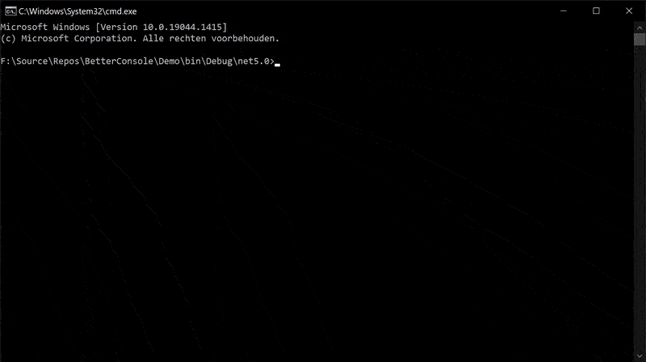

> ### Check out cocona
> Check out [Cocona](https://www.nuget.org/packages/Cocona)
>

# BetterConsole

BetterConsole is a helper library for your console applications
it can draw ui to the console and parse comandline arguments

It can draw menus and editable text and numbers.
It doesn't interfere with Console.WriteLine() so you can use Console.WriteLine() and BetterConsole.UI together.

Checkout the Demo project to see how to use it.

